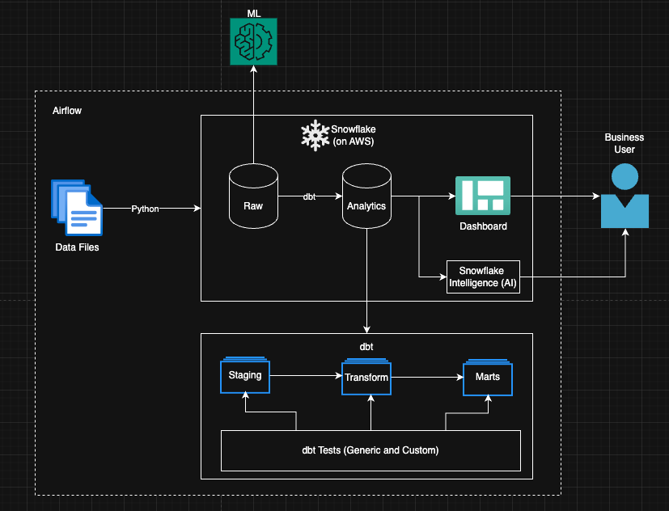
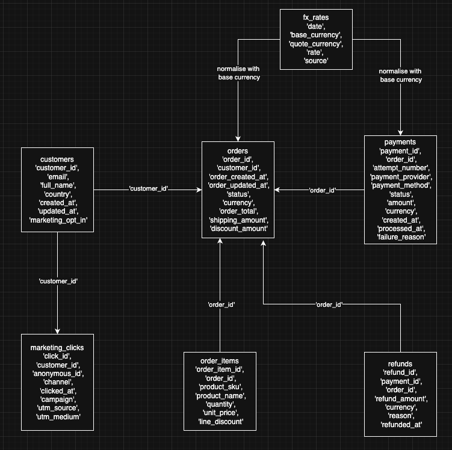

# ELT Project

## Problem Statement

Create an ELT batch pipeline and an AI agent using Snowflake Intelligence, allowing stakeholders to query the data, saving the data team time on adhoc data analysis queries.

There are some data provided in a CSV format (in folder) data that can be used.

To do so, an end-to-end pipeline needs to be set up. 

This document provides the architecture (including considerations for wider use case such as ML and AI), the data model design (star schema) and setup instructions.

Due to time and limitations, there are some future enhancements proposed below.

# Solution
### Architecture

### Data model 

# Future Enhancements
1. Customised DBT Tests
    - Every non-USD payment must have a matching FX rate on its payment date.
    - Completed/shipped orders must have at least one order item.
    - Refund total for an order must not exceed what was paid.
2. Tests on Transformed and Mart Models.
3. Productionise the pipeline.

# Setup
- Create a Snowflake account
- Clone repo locally
- Install DBT Core locally
- Generate private and public keys using Terminal
- Assign setup (default) user to the public key in Snowflake
- 2 methods to complete the setup process, use one
    - Run python script run_setup.py to execute snowflake_setup.sql in Snowflake which will create the necessary resources.
    - Can also use terraform in the infrasture folder.
- Assign dbt user to the public key in Snowflake
- Connect DBT Core to Snowflake via key-pair authentication
    - enter the following details:
    - Snowflake account
    - Snowflake user
    - Desired authentication type option (enter a number): 2
    - generate private and public keys and enter the private_key_path
- Run dbt debug to confirm the status of the connection
- Run python script snowflake_ingestion.py to ingest the CSV data into Raw database in Snowflake
- Run dbt deps
- Run dbt build to run the whole project (including models and tests)
- Upload semantic yml / model
- Enable Cortex by running "ALTER ACCOUNT SET CORTEX_ENABLED_CROSS_REGION = 'ANY_REGION';" in UI 
- Create a Cortex Agent and connect it to Snowflake Intelligence